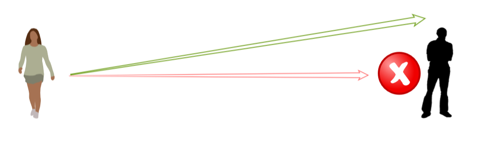

## Local Avoidance

Local Avoidance is a system which automatically adjusts the output from [Context Aware Steering Actions](../SteeringBehaviours) to avoid collisions with other agents. This significantly improves the appearance of groups of agents moving in close proximity. Overcrowded includes a novel **Multi Sampled Local Avoidance** algorithm which rapidly chooses collision free movement directions for every agent in the scene simultaneously.

### Using Local Avoidance

Local Avoidance is built into the core [Navigator](../../Reference/MonoBehaviours/Navigator) Monobehaviour. To use it simply [create an agent](../../HowTo/CreateAnAgent), open the [Navigator](../../Reference/MonoBehaviours/Navigator) inspector, turn on [`Block Other Agents`](../../Reference/MonoBehaviours/Navigator#block-other-agents) to make other agents avoid this agent and turn on [`Avoid Local Obstacles`](../../Reference/MonoBehaviours/Navigator#avoid-local-obstacles) to make this agent avoid nearby obstacles (including other agents).

### Configuring Local Avoidance

With the default settings local avoidance will improve the movement of all agents around the scene. However, you may want to configure certain agents to move in different ways. For example all NPCs should avoid collisions with the player character even if it means colliding with other NPCs.

### Priority

When two agents are walking towards a collision they must both adjust their movement direction to avoid the collision. Priority controls how much each agent is willing to adjust their direction.

If both of these agents have an _equal_ priority they will both adjust their direction the same amount (as shown above). If one agent has a slightly higher priority then it will adjust it's direction less than the agent with the lower priority. If one agent has a much higher priority (difference is greater than one) then it will not adjust it's direction at all, leaving the lower priority agent will adjust it's direction to avoid the collision.

This can be used to create more "important" agents which other agents will try not to block. For example:
 - Important storyline NPCs can have a much higher priority than basic "crowd filler" NPCs
 - Boss NPCs can have a higher priority than basic enemy NPCs
 - Player characters can have higher priority than NPCs

## Personality

todo

## Advanced Configuration

todo

### Urgency

There will always be situations where a Local Avoidance algorithm will fail to find a collision free direction for some agents to move in. This can sometimes leave a few low priority agents stuck at the edges of a Crowd, failing to ever make any progress. Overcrowded includes an innovative solution to this problem: Urgency.

Urgency increases when an agent is not making any progress and temporarily makes the agent more "selfish" - this allows it to push past the obstacle that was stopping it. This selfishness can help clear blockages in crowds and significantly improves the overall flow of agents through the scene even in areas where a conventional Local Avoidance algorithm would fail.

As urgency increases an agent automatically increases it's priority and reduces it's personal space radius. High priority forces other agents in the area to try harder to avoid collisions. A smaller personal space allows the agent to squeeze through narrow gaps which it could not previously fit through. When Urgency is very high (indicating that the agent has been failing to move for a long time) a proxy obstacle is created next to the agent in the direction it wants to travel. Other agents avoid the proxy obstacle which clears space for the agent to move into, this guarantees that an agent eventually makes progress.

To add Urgency to an agent simply add an [Navigator](../../Reference/MonoBehaviours/Urgency) MonoBehaviour alongside the [Navigator](../../Reference/MonoBehaviours/Navigator) MonoBehaviour.