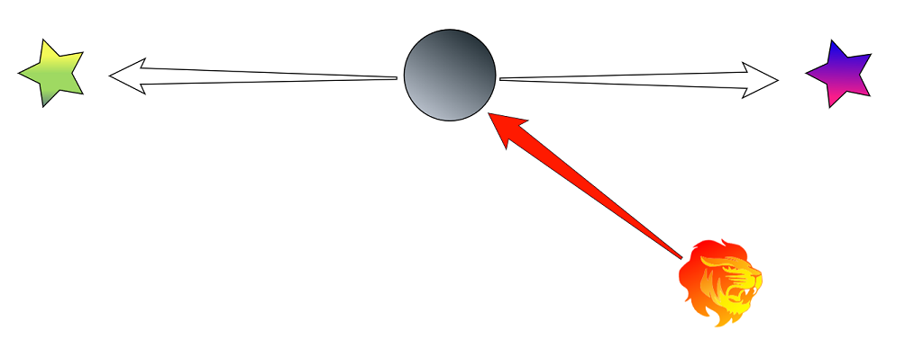
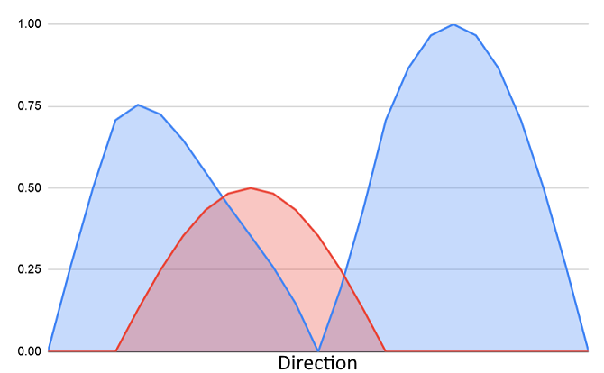

## Steering Behaviours

Steering behaviours are a way of breaking down the complex job of steering an agent step-by-step through an environment. They were [originally designed by Craig Reynolds](http://www.red3d.com/cwr/steer/gdc99/) in 1999. Steering behaviours each individually perform a single very simple type of movement, for example:

 - [**Arrive**](/Reference/MonoBehaviours/SteerForArrival) at a position.
 - [**Flee**](/Reference/MonoBehaviours/SteerForFlee) away from a position.
 - [**Pursue**](/Reference/MonoBehaviours/SteerForPursue) a moving target by predicting it's movements.
 - [**Evade**](/Reference/MonoBehaviours/SteerForEvade) a moving target by predicting it's movements.
 - [**Wander**](/Reference/Monobehaviours/SteerForWander) randomly around.
 - [**Follow**](/Reference/MonoBehaviours/SteerForGoal) a path generated by pathfinding.

An agent will usually have several of these behaviours which are blended together to form more complex and natural movements.

### Steering Context

Basic steering behaviours as described above have been used in many games over the years, but they have a serious problem. If two steering behaviours point in opposite directions simply adding them together will result in the agent standing still! This basic approach can result in agent appearing "indecisive" as they hover around the midpoint or very slowly move to one side.

Crowds solves this problem with a "steering context". Each steering behaviours outputs how much it wants to move in a set of fixed directions and then the final direction is picked from this set. The final decision is made by selecting the direction which most steering behaviours want to move in. For the above example the context would look like this:

Because this is a tie (both peaks are the same) one of the two directions would be chosen. This makes agent appear much more decisive even when there are many steering behaviours influencing them.

### Sensors

The steering behaviours indicate a direction that the agent wants to move in. Crowds adds another concept to the context map: danger sensors. A sensor detects something which an agent should avoid if possible. The danger sensors modify the weights in the concept map to influence the final chosen direction.

In this example there is a dangerous lion to the right. A sensor that detects lions would add some danger to the context map in that direction, danger reduces the weight of the steering behaviours which it overlaps. This breaks the tie between the two peaks and then agent will now always choose the direction away from the danger.

todo: link to ref docs for various sensors, explain overall steering+danger sensor workflow