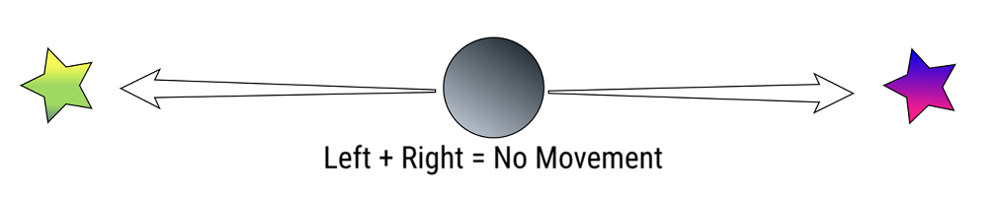
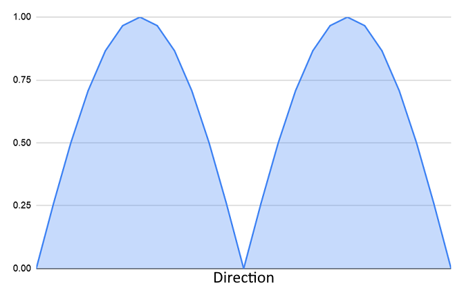
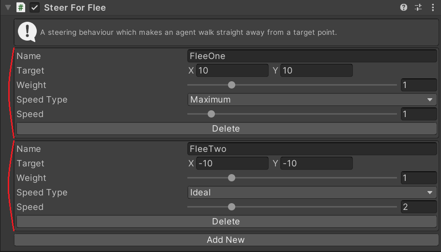

## Steering Actions

Steering actions are a way of breaking down the complex job of steering an agent step-by-step through an environment. They were [originally designed by Craig Reynolds](http://www.red3d.com/cwr/steer/gdc99/) in 1999. Steering actions each individually perform a single very simple type of movement, for example:

 - [**Arrive**](../../Reference/MonoBehaviours/Steering/SteerForArrival) at a position.
 - [**Flee**](../../Reference/MonoBehaviours/Steering/SteerForFlee) away from a position.
 - [**Pursue**](../../Reference/MonoBehaviours/Steering/SteerForPursue) a moving target by predicting it's movements.
 - [**Evade**](../../Reference/MonoBehaviours/Steering/SteerForEvade) a moving target by predicting it's movements.
 - [**Wander**](../../Reference/Monobehaviours/Steering/SteerForWander) randomly around.
 - [**Follow**](../../Reference/MonoBehaviours/Steering/SteerForGoal) a path generated by pathfinding.

An agent will often have several of these actions which are blended together to form more complex and natural movements.

### Context Aware Steering Actions

Basic steering actions as described above have been used in many games over the years. However they have a serious problem: if two steering actions point in opposite directions they will cancel out and the agent will not move! If no workaround is applied this can result in agents appearing indecisive as they stay around the midpoint of conflicting actions. A real person would make a decision and go to one of the two locations.

Overcrowded solves this problem with "Context Aware Steering Actions". Each steering action outputs how much it wants to move in a direction and then a final decision is made by finding the most desirable direction to move in. This means that you can add any numbers of steering actions to influence the movement of an agent in many ways and the agent will still appear to be decisive.

In the above example the steering action would output that they want to move left and move right:

The final decision picks the best direction - in this case because it's a tie an arbitrary decision is made. This is much more realistic than taking the average direction; a person who wants to walk to two locations won't move towards the midpoint they will instead walk to one and then the other.

The steering context is not just used for steering actions (deciding where to go) but can also be used for steering sensors (deciding where **not** to go). This can be used to inject gameplay considerations into the movement system, making it appear as if agents are aware of the scene and avoiding enemies/dangers. [Read more about Steering Sensors](../SteeringSensors).

### Multiple Steering Actions

In Overcrowded, each type of steering action is represented by a MonoBehaviour. In some cases you may want several of the same steering action attached to a single Agent (e.g. _Flee_ from 2 things simultaneously), but Unity does not allow multiple copies of the same MonoBehaviour. To solve this problem the Overcrowded steering MonoBehaviours can each represent several copies of the same steering action:

This `SteerForFlee` inspector shows two flee actions named `FleeOne` and `FleeTwo` fleeing from two different points.

### Continued Reading

[Steering Sensors](../SteeringSensors.md) adjust the steering context to discourage agents from walking in certain directions - such as towards gameplay dangers.
[Local Avoidance](../LocalAvoidance.md) adjusts the output of context aware steering actions to avoid collisions with obstacles in the scene - such as walls and other agents.