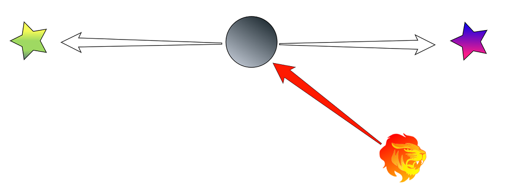
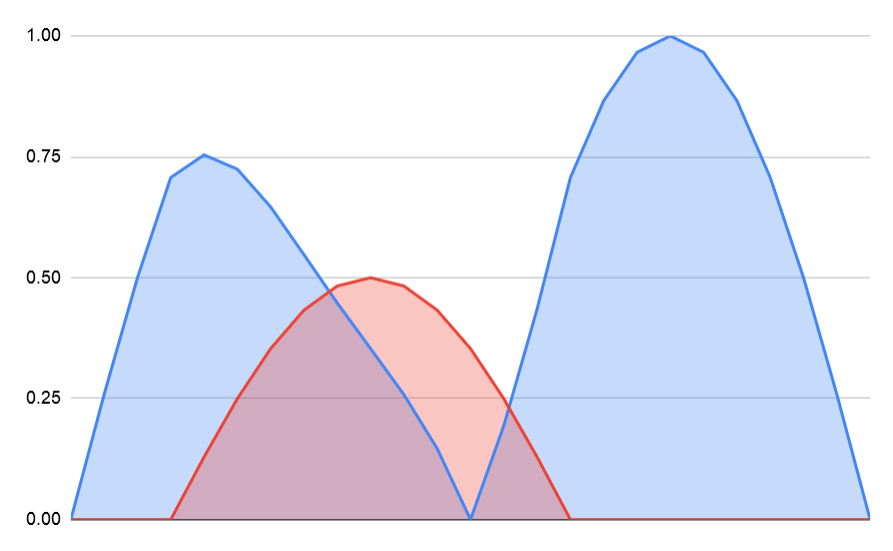

todo: steering sensors (see SteeringActions doc, move some of that over here)

### Danger Sensors

[Steering actions](../SteeringActions) indicate a direction that an agent _should_ to move in. Danger sensors do the opposite: they sense directions which the agent _should not_ move in. Danger sensors work in a similar way to steering actions, each sensor adds some weight to directions it considers risky, the final danger map is used to modify the steering context before picking a direction.

In this example there is a dangerous lion to the right. A sensor that detects lions adds some danger to the steering context in that direction which reduces the desire of the agent to move to the in that direction. Now the tie is broken and the agent will always move to the left because it is less dangerous.

Overcrowded includes a library of easy to use sensors which can be adapted to a number of different scenarios:

 - [**AgentProximitySensor**](../../Reference/MonoBehaviours/Sensing/AgentProximitySensor)
 - [**CircleSensor**](../../Reference/MonoBehaviours/Sensing/CircleSensor)
 - [**GameObjectSensor**](../../Reference/MonoBehaviours/Sensing/GameObjectSensor)
 - [**LineSensor**](../../Reference/MonoBehaviours/Sensing/LineSensor)
 - [**PointSensor**](../../Reference/MonoBehaviours/Sensing/PointSensor)

### How To

todo: link some how-to guides on steering and sensors

todo: add section on modes