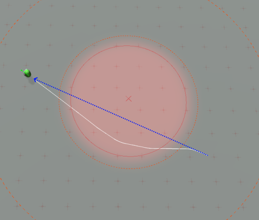

Steering Sensors are a unique feature of the Overcrowded steering system. A [Steering Action](../SteeringActions) tells the agent where it **should** go, whereas steering sensors tell an agent where it **should not** go. A steering sensor will never make an agent move, instead it simply influences the movement caused by steering actions. This can be used to inject gameplay considerations, such as avoiding dangerous areas or enemies, directly into the steering decisions of agents in the game.

For example in this image a steering sensor is creating an area the agent should avoid, shown by the red circle. A [Steer For Arrival](../../Reference/MonoBehaviours/Steering/SteerForArrival) action is telling the agent to move directly towards the end point, along the dotted blue line. Instead the agent path has curved around to avoid the middle of the danger zone, as shown by the solid white line.

A single agent can be influenced by many steering sensors simultaneously. Overcrowded includes a library of easy to use sensors which can be adapted to many different scenarious:

 - [**CircleSensor**](../../Reference/MonoBehaviours/Sensing/CircleSensor) - avoid a circular area centred on a point.
 - [**LineSensor**](../../Reference/MonoBehaviours/Sensing/LineSensor) - avoid moving directly towards a line.
 - [**PointSensor**](../../Reference/MonoBehaviours/Sensing/PointSensor) - avoid moving towards a specific point.
 - [**GameObjectSensor**](../../Reference/MonoBehaviours/Sensing/GameObjectSensor) - avoid another GameObject.
 - [**NegativeDirectionZone**](../../Reference/MonoBehaviours/Zones/NegativeZone) - influences all agents within a physics zone to avoid moving in specific directions.

### Continued Reading

 - [Steering Actions](../SteeringActions) drive an agent to move in a specific direction.
 - [Local Avoidance](../LocalAvoidance) adjusts the output of context aware steering actions to avoid collisions with obstacles in the scene - such as walls and other agents.
 - [How To: Avoid Danger](../../HowTo/AvoidDanger) A simple tutorial on how to use a single sensor.