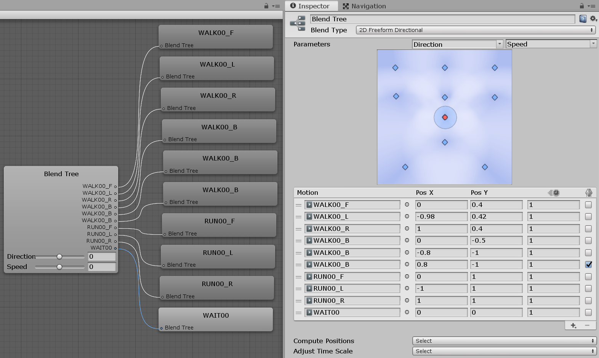

Overcrowded agents are very similar to Unity NavMeshAgents with respect to Animation - the navigation system outputs a velocity which should be followed and an animation script is responsible for starting an animation that will move the agent in this direction. Much of the advice in the Unity documentation on [Coupling Animation and Navigation](https://docs.unity3d.com/Manual/nav-CouplingAnimationAndNavigation.html) is relevant.

### Synchroniser

The most common approach to moving agents in sync with Overcrowded is to use the [`Synchroniser`](/Reference/MonoBehaviours/Synchroniser.md) script. If this is configured in the editor to the `Simulation Is Master` mode the GameObject will be moved around under the control of the Overcrowded simulation.

However in this mode there is no animation, the agent simply slides around the scene. To drive animation the `Synchroniser` should instead be set to the `GameObject Is Master` mode, **in this mode the GameObject will not move at all** and the simulation will be reset to the GameObject position at the start of every frame.

### Animation Script

Now that the agent is not moving it is possible to write an animation script which will move the agent using animation in response to Overcrowded simulation output. Most scripts to drive animation will follow a similar template:

```csharp
private void Awake()
{
    // Get animation controller
    _animator = GetComponentInChildren<Animator>();

    // Get Overcrowded agent
    _navigator = GetComponent<Navigator>();
}

private void Update()
{
    // Step 1: Fetch the velocity which the agent should move at according to the simulation
    var target_velocity = GetComponent<Navigator>().AdjustedVelocity;

    // Step 2: Choose which animation to play based on the `target_velocity`. How to do this depends
    // on what how you have set up your animation controller. See `UnityChanNavigationAgent.cs` for an example.
    ???

    // Step 3: Move the agent in the scene according to the animation that you have chosen.
    transform.position += velocity_from_animation * Time.deltaTime;

    // Step 4: Inform Overcrowded simulation what velocity the agent is moving at.
    _navigator.Velocity = velocity_from_animation;
}
```

There is an example of a script which does this included in the package at `Assets/Plugins/PlaceholderSoftware/Crowds/Demos/Content/Characters/UnityChan/Scripts/UnityChanNavigationAgent.cs`. This script drives an agent ([Unity Chan](https://assetstore.unity.com/packages/3d/characters/unity-chan-model-18705?aid=1100lJDF)) set up with an [Animation Blend Tree](https://docs.unity3d.com/Manual/class-BlendTree.html):



The animation blend tree is set up with animations for run/walk/reverse while leaning left/center/right. There are two animation parameters which select blend of animations to play: `Direction` (Left/Right) and `Speed` (Forward/backward). The `UnityChanNavigationAgent` script uses:

```csharp
_animator.SetFloat("Speed", speed_value);
_animator.SetFloat("Direction", direction_value);
```

to set the blend of which animation to play.

### Velocity Matching

The velocity that an agent actually moves with does not have to closely follow the Overcrowded simulation output. `AdjustedVelocity` simply exposes the best velocity to move at according to Overcrowded - your script can tweak this value slightly (e.g. to exactly match an available animation) or even ignore it completely if necessary. Setting the `_nevigator.Velocity` property (step 4 in the example above) informs Overcrowded how the agent actually moved.

The `UnityChanNavigationAgent.cs` script demonstrates this when reversing. When the simulation wants the agent to move backwards (at any speed) the script will use a slow walk backwards animation. After reversing for a short amount of time the agent will stop, spin on the spot, and begin walking forwards. A simple continuous velocity from overcrowded is turned into a complex sequence of animations.