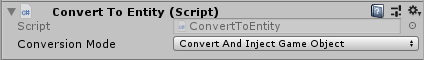
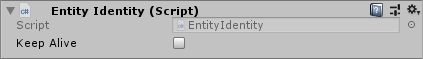

# How To Create An Agent

1. Create a new `GameObject` in the scene
2. Add a `Convert To Entity` behaviour and configure it like this:

3. Add an `Entity Identity` behaviour and configure it like this:

4. Add a `Navigator` behaviour and configure it as necessary for your agent. See the [reference documentation](../Reference/MonoBehaviours/Navigator.md) for this component.
5. Add [Steering Behaviours](../GettingStarted/SteeringBehaviours.md) to make your gameObject move.

todo: mention synchroniser configuration