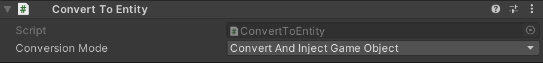
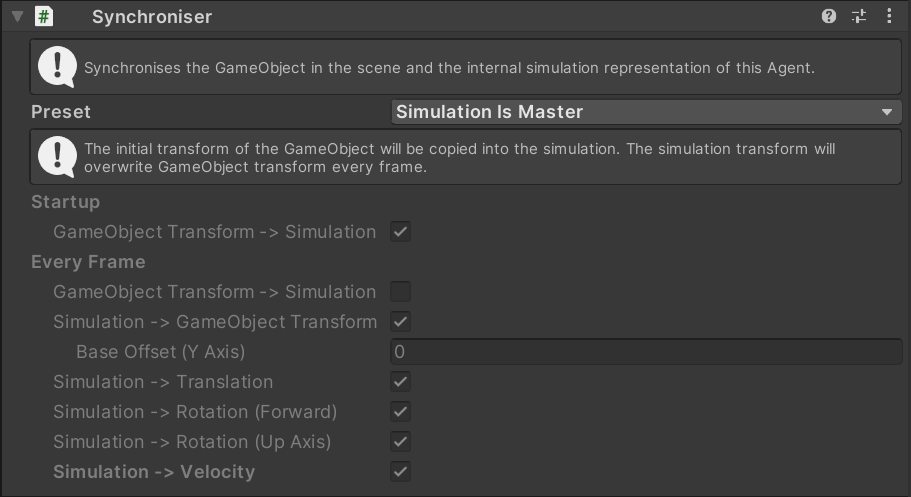

# How To Create An Agent

1. Create a new `GameObject` in the scene
2. Add a [`Navigator`](../Reference/MonoBehaviours/Navigator.md) behaviour.
3. Configure the `Convert To Entity` behaviour like this:

4. Add a [`Synchroniser`](../Reference/MonoBehaviours/Synchroniser.md) behaviour and configure it like this:

5. Add [Steering Behaviours](../GettingStarted/SteeringBehaviours.md) to make the agent move.