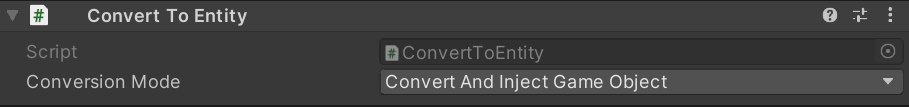

The Unity `NavMeshAgent` is a basic component for controlling characters in a game - if you already have characters in a game it is likely you're already using this component to drive them. Overcrowded has a "drop in" MonoBehaviour called the `EnhancedNavMeshAgent` which replaces almost all of the functionality of the `NavMeshAgent` with better alternatives.

To migrate from the `NavMeshAgent`:

 1. Add an `EnhancedNavMeshAgent` component to the GameObject, this will automatically add several other components.
 2. Ensure that the `Convert To Entity` script that was automatically added is configured like this: .
 3. Click `Import From Nav Mesh Agent` to copy settings from the `NavMeshAgent` script.
 4. Click `Auto Configure Synchroniser` to automatically set up synchronisation between the ECS simulation and the GameObject.