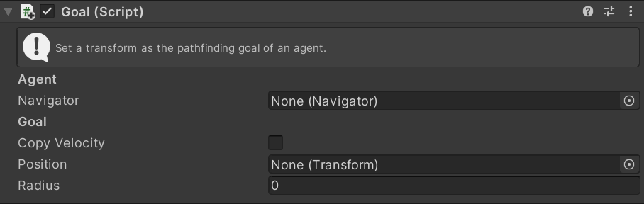

# Goal

This MonoBehaviour automatically sets the `GoalPosition`, `GoalRadius` and `GoalVelocity` properties on a `Navigator` agent.

## Inspector

#### Navigator

The `Navigator` to set the properties on. If set to null then it will be automatically fetched using `GetComponent<Navigator>()`.

#### CopyVelocity

If this is set to true the `GoalVelocity` property of the Navigator is set based on the velocity of the `Position` gameObject.

The velocity is determined from:
 - If the `Position` gameObject has a `Navigator` component it's velocity will be copied.
 - Otherwise if the `Position` gameObject has a `RigidBody` then it's velocity will be copied.
 - Otherwise no velocity will be set.

#### Position

The `Transform` to set as the goal position.

#### Radius

The radius of the goal position.