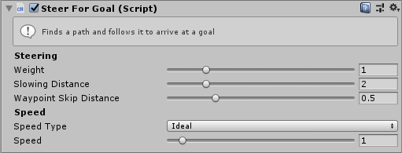

# Goal

This MonoBehaviour makes it easy to configure the goal position for an agent within the Editor.

## Inspector

todo: take that screenshot ^

#### Navigator

The `Navigator` to set the `GoalPosition` and `GoalVelocity` properties on. If not set then it will be automatically fetched using `GetComponent<Navigator>()`.

#### Position

The `Transform` to set as the goal.

#### CopyVelocity

If this is set to true the `GoalVelocity` property of the Navigator is set based on the velocity of the `Position` gameObject.

If the `Position` gameObject has a `Navigator` component it's velocity will be copied. Otherwise if the `Position` gameObject has a `RigidBody` then it's velocity will be copied. If neither is present then no velocity will be set.