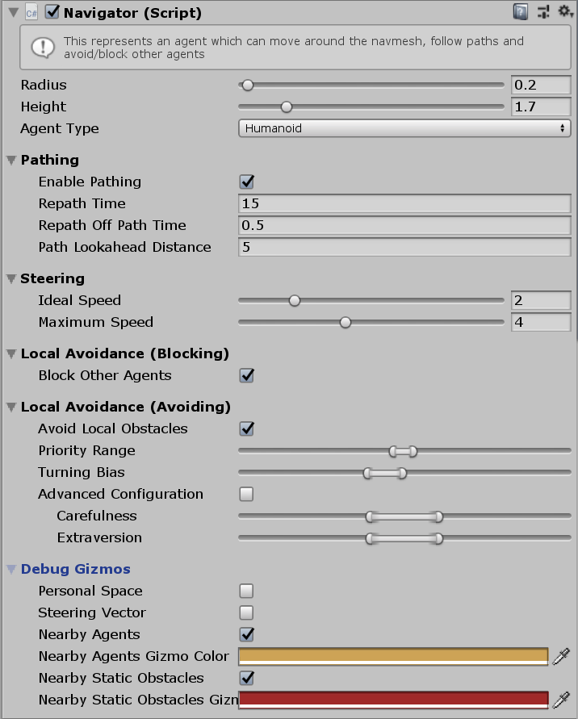

# Navigator

This MonoBehaviour is the main behaviour which configures a gameObject as an intelligent Agent.

## Inspector

!!! note
    Some of the following properties set a range instead of a single value, when the agent is first initialised it will choose a random value in this range. This means that if you instantiate many prefabs of the same agent prefab they will all act slightly differently which significantly improves the quality of simulation for large crowds.

#### Radius

The radius of the agent in the simulation. Other agents will never attempt to walk within this circle.

#### Height

The height of the agent in the simulation. The agent will avoid obstacles (e.g. walls and other agents) which are within it's height span.

#### Agent Type

Agent type used for pathfinding. Available types are configured in the Unity navigation window: `Window > AI > Navigation > Agents`.

### Pathfinding

#### Enable Pathing

Allow this entity to automatically find a path to it's goal (if it has a goal).

#### Repath Time

How often (measured in seconds) the path will be automatically recalculated.

#### Repath Off Path Time

If the agent is not on it's calculated path for this many seconds the path will be automatically recalculated.

#### Path Lookahead Distance

todo

### Steering

#### Ideal Speed

The speed which this agent prefers to move at.

#### Maximum Speed

The maximum speed which this agent can move at.

### Local Avoidance (Blocking)

#### Block Other Agents

Whether or not this agent is an obstacle to other agents. If set to `false` other agents will not try to avoid this agent.

### Local Avoidance (Avoiding)

#### Avoid Local Obstacles

Whether or not this agent shoiuld avoid obstacles (walls and other agents).

#### Priority (Range)

Priority determines how much an agent will yield to avoid a collision with another agent. The ratio of their priorities determines how much each agent yields.

#### Turning Bias (Range)

Turning bias which way an agent prefers to turn to avoid a collision. If many agents in a crowd share the same bias the movement of the crowd will flow much more smoothly.

#### Advanced Configuration

Toggle how this agent is configured. When enabled you can set the `Personal Space Radius`, `Time Horizon (Obstacles)`, `Time Horizon (Agents)`, `Max Neighbour Search Radius`, `Max Neighbour Count` and `Personal Space` properties. When disabled you can set the `Carefulness` and `Extraversion` properties which will automatically determine reasonable values for the advanced properties.

#### Carefulness (Range)

An agent with a high carefulness will try harder to avoid collisions with other agents in the crowd. This can cause a more erratic movement.

#### Extraversion (Range)

An agent with high extraversion will try harder to push through the crowd. This can cause more collisions.

#### Personal Space Radius

todo

#### Time Horizon (Obstacles)

todo

#### Time Horizon (Agents)

todo

#### Max Neighbour Search Radius

todo

#### Max Neighbour Count

todo

### Debug Gizmos

#### Personal Space (Gizmos)

If checked, the agent will show it's "personal space" (the circle it tries to avoid letting other agents in to).

#### Steering Vector

If checked, the agent will show it's steering vector (the vector it is trying to steer along).

#### Nearby Agents

If checked, the agent will show all the nearby agents it is trying to avoid.

#### Nearby Static Obstacles

If checked, the agent will show all the nearby static obstacles (walls) it is trying to avoid.