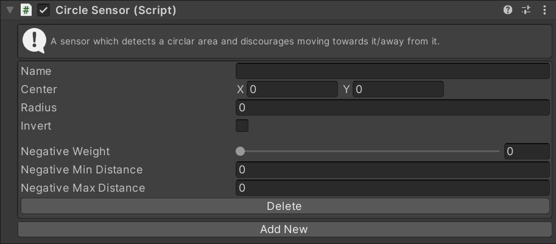

# CircleSensor

This MonoBehaviour detects a circular area as a danger and discourages steering towards it.

## Inspector

#### Name

The unique ID of this sensor. Used to identify this instance in scripts.

#### Point

The XZ position of the center of the circle.

#### Radius

The radius of the circle.

#### Invert

If checked, all directions _away_ from the circle will be detected as a danger. If unchecked the directions _towards_ the circle will be detected as a danger.

#### Negative Weight

The importance of this negative sensor relative to other sensors.

#### Negative Min Distance

If the circle is closer than this distance, the full `Negative Weight` will be used.

#### Negative Max Distance

If the circle is farther than this distance, the sensor will be not detect it.

## Scripting

#### `Create(string instanceName)`

Create a new sensor with the given name. If the name is `null` a random name will be chosen.

#### `TryGet(string instanceName)`

Try to get an existing sensor with the given name. Returns `null` if there is no sensor with that name.

#### `bool TryDelete(string instanceName)`

Try to delete the sensor with the given name. Returns `true` if a sensor with that name existed and was deleted.