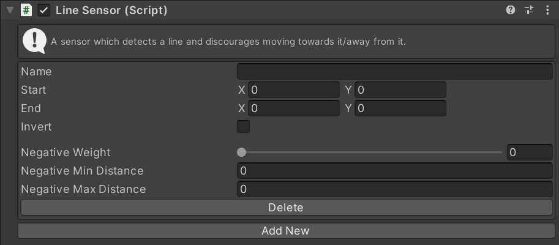

# LineSensor

This MonoBehaviour detects a line as a danger and discourages steering towards it.

## Inspector

^^ todo: take that screenshot

#### todo: Property Name

todo: Property description.

## Scripting

#### `Create(string instanceName)`

Create a new sensor with the given name. If the name is `null` a random name will be chosen.

#### `TryGet(string instanceName)`

Try to get an existing sensor with the given name. Returns `null` if there is no sensor with that name.

#### `bool TryDelete(string instanceName)`

Try to delete the sensor with the given name. Returns `true` if a sensor with that name existed and was deleted.