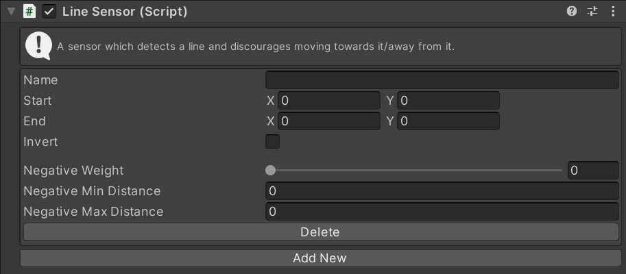

# LineSensor

This MonoBehaviour detects a line as a danger and discourages steering towards it.

## Inspector

#### Name

The unique ID of this sensor. Used to identify this instance in scripts.

#### Start

The XZ position of the start of the line.

#### End

The XZ position of the end of the line.

#### Invert

If checked, all directions _away_ from the line will be detected as a danger. If unchecked the directions _towards_ the line will be detected as a danger.

#### Notch
If checked the sensor will <b>not</b> detect danger directly towards the line when the agent is within the min negative distance. This gives the appearance of the agent making a decision to quickly dash across the danger at the last second. Not compatible with inverted sensors.

#### Negative Weight

The importance of this negative sensor relative to other sensors.

#### Negative Min Distance

If the line is closer than this distance, the full `Negative Weight` will be used.

#### Negative Max Distance

If the line is farther than this distance, the sensor will be not detect it.

## Scripting

#### `Create(string instanceName)`

Create a new sensor with the given name. If the name is `null` a random name will be chosen.

#### `TryGet(string instanceName)`

Try to get an existing sensor with the given name. Returns `null` if there is no sensor with that name.

#### `bool TryDelete(string instanceName)`

Try to delete the sensor with the given name. Returns `true` if a sensor with that name existed and was deleted.