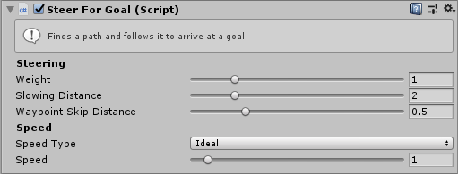

# SteerForGoal

This MonoBehaviour causes an agent to steer along a pathfinding path to a goal point. It requires `Navigator > Enable Pathing` enabled to generate a path.

The goal point can be set to have a velocity as well as a position, in this case the agent will attempt to match it's velocity with the goal velocity as it reaches the goal position.

## Inspector

#### Weight

The Weight of this steering behaviour in the weighted average with all other steering behaviours.

#### Slowing Distance

The Agent will begin matching the goal velocity when it is this far away from the goal position.

#### Waypoint Skip Distance

The agent will ignore waypoints on the path which are closer than this distance. This causes agents to slightly cut the corner of paths, creating a more natural motion.

#### Speed Type

The units for the `Speed` property. `Direct` means that the `Speed` setting is a speed in units/second. `Ideal` means that the `Speed` is a multiplier of the ideal speed (set in the `Navigator`). `Maximum` means that the `Speed` is a multiplier of the maximum speed (set in the `Navigator`).

#### Speed

The speed to move away from the target at. The units of this value depend on the `Speed Type` property.