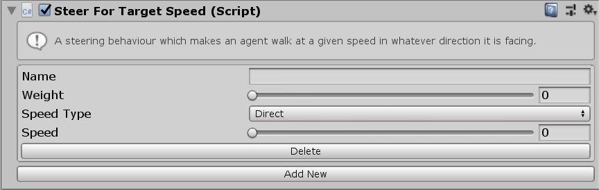

# SteerForTargetSpeed

This MonoBehaviour causes an agent to move forwards at a given speed.

## Inspector

#### Weight

The Weight of this steering behaviour in the weighted average with all other steering behaviours.

#### Speed Type

The units for the `Speed` property. `Direct` means that the `Speed` setting is a speed in units/second. `Ideal` means that the `Speed` is a multiplier of the ideal speed (set in the `Navigator`). `Maximum` means that the `Speed` is a multiplier of the maximum speed (set in the `Navigator`).

#### Speed

The speed to move towards the target at. The units of this value depend on the `Speed Type` property.

todo: refactor for buffer steering