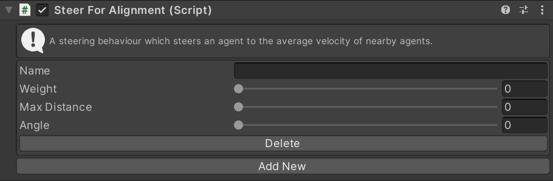

# SteerForAlignment

This MonoBehaviour causes an agent to steer in the average direction of all nearby agents.

## Inspector

#### Name

The target position (in 2D space) that the agent is walking towards. For example if you have a `transform` to walk towards you would set this to the `XZ` position of the `transform`.

#### Weight

The importance of this behaviour relative to other steering behaviours.

#### Max Distance

Only agents within this distance will contribute to the average direction.

#### Angle

Only agents in front of the agent (within this angle) will contribute to the average direction.

### Add New/Delete

todo