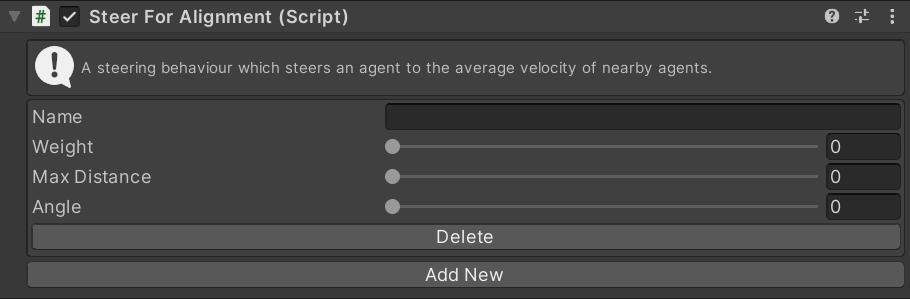

# SteerForAlignment

This MonoBehaviour causes an agent to steer in the average direction of all nearby agents.

## Inspector

#### Name

The unique ID of this steering action. Used to identify this instance in scripts.

#### Weight

The importance of this action relative to other steering actions.

#### Max Distance

Only agents within this distance will contribute to the average direction.

#### Angle

Only agents in front of the agent (within this angle) will contribute to the average direction.

#### Delete/Add New

Create a new instance of this steering action or delete an existing instance.

## Scripting

#### `Create(string instanceName)`

Create a new steering action with the given name. If the name is `null` a random name will be chosen.

#### `TryGet(string instanceName)`

Try to get an existing steering action with the given name. Returns `null` if there is no action with that name.

#### `bool TryDelete(string instanceName)`

Try to delete the steering action with the given name. Returns `true` if an action with that name existed and was deleted.