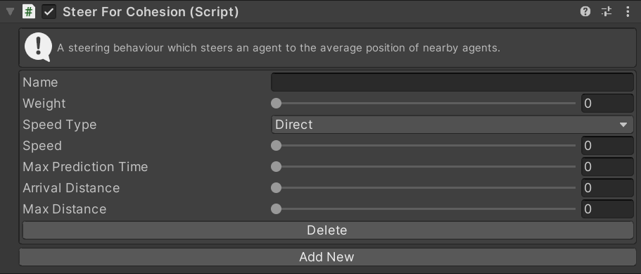

# SteerForCohesion

This MonoBehaviour causes an agent to [pursue](../SteerForPursue.md) the average location of all nearby agents.

## Inspector

#### Name

The target position (in 2D space) that the agent is walking towards. For example if you have a `transform` to walk towards you would set this to the `XZ` position of the `transform`.

#### Weight

The importance of this action relative to other steering actions.

#### Speed Type

The units for the `Speed` property. `Direct` means that the `Speed` setting is a speed in units/second. `Ideal` means that the `Speed` is a multiplier of the ideal speed (set in the `Navigator`). `Maximum` means that the `Speed` is a multiplier of the maximum speed (set in the `Navigator`).

#### Speed

The speed to move away from the target at. The units of this value depend on the `Speed Type` property.

#### Max Prediction Time

The amount of time (in seconds) to predict the movement of nearby agents before steering for cohesion.

#### Arrival Distance

The distance from the average point to begin slowing to a stop.

#### Max Distance

The maximum distance of an agent to include in cohesion steering. Agents further away than this will be ignored.

### Add New/Delete

Create a new instance of this steering behaviour or delete an existing instance.

## Scripting

#### `Create(string instanceName)`

Create a new steering action with the given name. If the name is `null` a random name will be chosen.

#### `TryGet(string instanceName)`

Try to get an existing steering action with the given name. Returns `null` if there is no action with that name.

#### `bool TryDelete(string instanceName)`

Try to delete the steering action with the given name. Returns `true` if an action with that name existed and was deleted.
