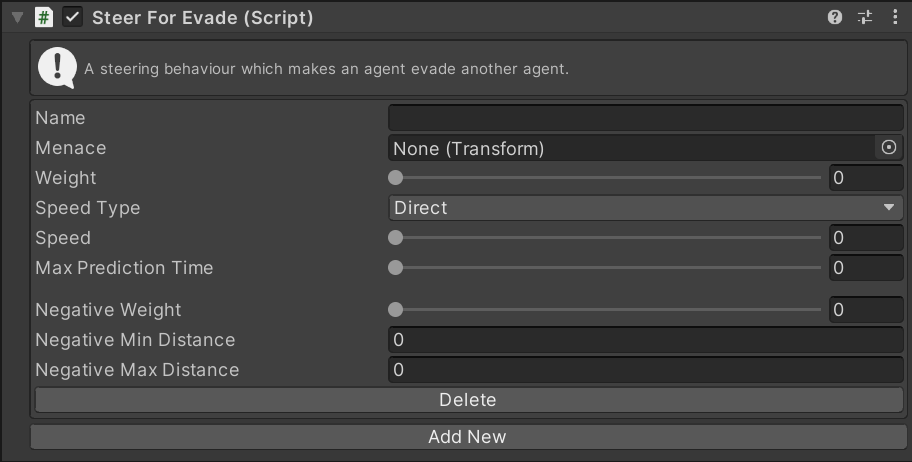

# SteerForEvade

This MonoBehaviour causes an agent to steer away from the predicted future position of another agent. If the supplied `transform` is not an agent this is exactly equivalent to [`SteerForFlee`](../SteerForFlee).

## Inspector

#### Menace

The `transform` which this Agent is evading.

#### Max Prediction Time

If the `Menace` transform is another Agent it's position will be predicted this many seconds into the future and then this this agent will flee from that predicted position. This produces more responsive evasion than simply fleeing the agent directly.

#### Weight

The Weight of this steering behaviour in the weighted average with all other steering behaviours.

#### Speed Type

The units for the `Speed` property. `Direct` means that the `Speed` setting is a speed in units/second. `Ideal` means that the `Speed` is a multiplier of the ideal speed (set in the `Navigator`). `Maximum` means that the `Speed` is a multiplier of the maximum speed (set in the `Navigator`).

#### Speed

The speed to move away from the target at. The units of this value depend on the `Speed Type` property.

todo: refactor for buffer steering