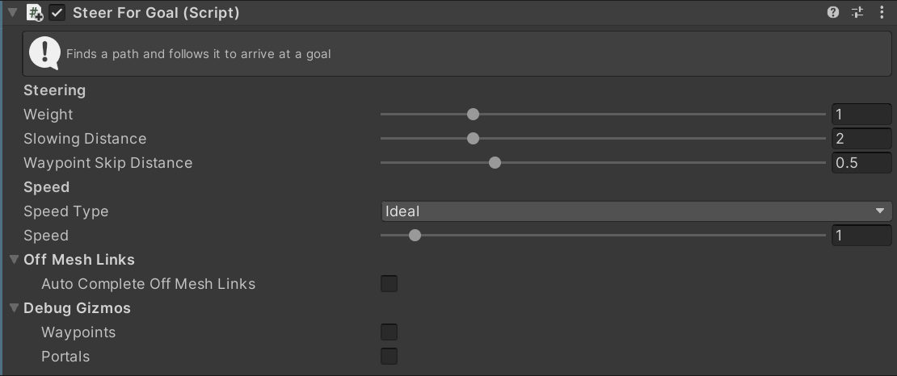

# SteerForGoal

This MonoBehaviour causes an agent to steer along a pathfinding path to a goal point. It requires `Navigator > Enable Pathing` enabled to generate a path.

The goal point can be set to have a velocity as well as a position, in this case the agent will attempt to match it's velocity with the goal velocity as it reaches the goal position.

## Inspector

#### Weight

The importance of this action relative to other steering actions.

#### Slowing Distance

The Agent will begin matching the goal velocity when it is this far away from the goal position.

#### Waypoint Skip Distance

The agent will ignore waypoints on the path which are closer than this distance. This causes agents to slightly cut the corner of paths, creating a more natural motion.

#### Speed Type

The units for the `Speed` property. `Direct` means that the `Speed` setting is a speed in units/second. `Ideal` means that the `Speed` is a multiplier of the ideal speed (set in the `Navigator`). `Maximum` means that the `Speed` is a multiplier of the maximum speed (set in the `Navigator`).

#### Speed

The speed to move away from the target at. The units of this value depend on the `Speed Type` property.

#### Autocomplete Off Mesh Links

Set if this agent should automatically complete off-mesh links by teleporting to the end of the link as soon as `IsWaitingAtOffMeshLink` becomes `true`.

## Scripting

#### `bool IsApproachingOffMeshLink`

Indicates if the Agent is on "final approach" to an off-mesh link. This means there are no more corners in the path between the current position of the agent and the start of the off-mesh link.

#### `PolygonId? OffMeshLinkPolygon`

Gets the [`PolygonId`](https://docs.unity3d.com/ScriptReference/Experimental.AI.PolygonId.html) of the off-mesh link which the agent is approaching. Returns `null` is `IsApproachingOffMeshLink` is `false`.

#### `bool IsWaitingAtOffMeshLink`

Indicates if the agent is standing still at the start of an off-mesh link, waiting to complete the link. When the agent is in this state you may move it in the scene (e.g. play an animation to cross the link).

#### `float? DistanceToOffMeshLink`

Indicates the distance to the start of the next off-mesh link. Returns `null` is `IsApproachingOffMeshLink` is `false`.

#### `PathfindingResultWaypoint? NextWaypoint`

Returns the next corner in the path which the agent is following. Returns `null` if there is no current path.

#### `CompleteOffMeshLink(bool teleport, bool checkOffPath)`

Mark the off-mesh link as completed.

`teleport` indicates if the agent should instantly teleport to the end of the off-mesh link or if a new path should be found and followed. `checkOffPath` indicates if the teleport/repathing behaviour should only be done if the agent is off path, otherwise the agent will simply continue following the path it was already on.