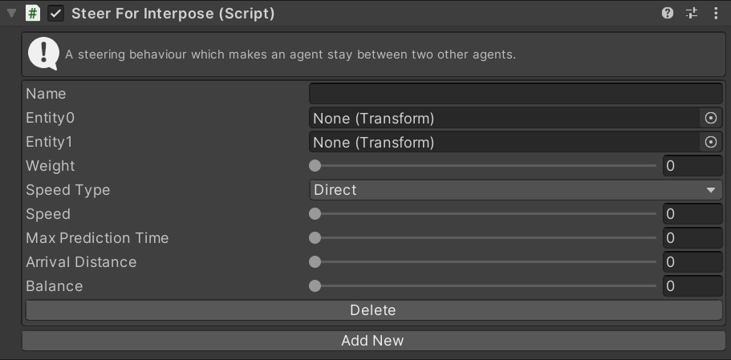

# SteerForInterpose

This MonoBehaviour causes an agent to [pursue](../SteerForPursue) a point between two other agents, ensuring it stays between them.

## Inspector

#### Name

The unique ID of this steering action. Used to identify this instance in scripts.

#### Entity0/Entity1

Set the two `transform`s that this agent should stay between.

#### Weight

The importance of this action relative to other steering actions.

#### Speed Type

The units for the `Speed` property. `Direct` means that the `Speed` setting is a speed in units/second. `Ideal` means that the `Speed` is a multiplier of the ideal speed (set in the `Navigator`). `Maximum` means that the `Speed` is a multiplier of the maximum speed (set in the `Navigator`).

#### Speed

The speed to move away from the target at. The units of this value depend on the `Speed Type` property.

#### Max Prediction Time

The amount of time (in seconds) to predict the movement of the two end points.

#### Arrival Distance

The distance from the center point to begin slowing to a stop.

#### Balance

How close the agent should be to each end. A value of `0` means it will be standing at the same position as `Entity0`. A value of `1` means it will be standing at the same position as `Entity1`. A value of `0.5` will be halfway between the two.

## Scripting

#### `Create(string instanceName)`

Create a new steering action with the given name. If the name is `null` a random name will be chosen.

#### `TryGet(string instanceName)`

Try to get an existing steering action with the given name. Returns `null` if there is no action with that name.

#### `bool TryDelete(string instanceName)`

Try to delete the steering action with the given name. Returns `true` if an action with that name existed and was deleted.