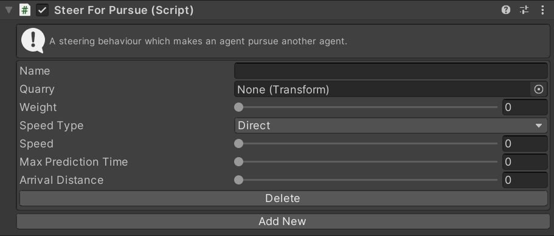

# SteerForPursue

This MonoBehaviour causes an agent to steer towards the predicted future position of another agent. If the supplied `transform` is not an agent this is exactly equivalent to [`SteerForArrival`](../SteerForArrival).

## Inspector

#### Name

The unique ID of this steering action. Used to identify this instance in scripts.

#### Quarry

The `transform` which this Agent is pursuing.

#### Max Prediction Time

If the `Quarry` transform is another Agent it's position will be predicted this many seconds into the future and then this this agent will steer to arrive at that predicted position. This produces more responsive pursuit than simply arriving at the quarry position directly.

#### Weight

The importance of this action relative to other steering actions.

#### Arrival Distance

The Agent will begin slowing to a stop when it is this far from the quarry.

#### Speed Type

The units for the `Speed` property. `Direct` means that the `Speed` setting is a speed in units/second. `Ideal` means that the `Speed` is a multiplier of the ideal speed (set in the `Navigator`). `Maximum` means that the `Speed` is a multiplier of the maximum speed (set in the `Navigator`).

#### Speed

The speed to move away from the target at. The units of this value depend on the `Speed Type` property.

#### Delete/Add New

Create a new instance of this steering action or delete an existing instance.

## Scripting

#### `Create(string instanceName)`

Create a new steering action with the given name. If the name is `null` a random name will be chosen.

#### `TryGet(string instanceName)`

Try to get an existing steering action with the given name. Returns `null` if there is no action with that name.

#### `bool TryDelete(string instanceName)`

Try to delete the steering action with the given name. Returns `true` if an action with that name existed and was deleted.