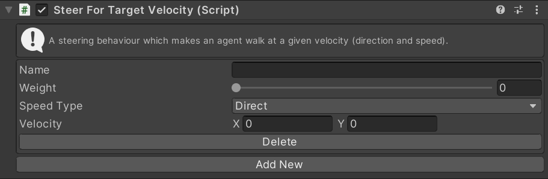

# SteerForVelocity

This MonoBehaviour causes an agent to steer at a specified velocity (direction and speed). This is often used to implement custom steering behaviours - a script can simply set the `Velocity` property.

## Inspector

#### Name

The unique ID of this steering action. Used to identify this instance in scripts.

#### Weight

The importance of this action relative to other steering actions.

#### Speed Type

The units for the `Velocity` property. `Direct` means that the `Velocity` will be unchanged. `Ideal` means that the `Velocity` will be multiplied by the agent `Ideal Speed` (set in the `Navigator`). `Maximum` means that the `Velocity` will be multiplied by the agent `Maximum Speed` (set in the `Navigator`).

#### Velocity

The velocity which this agent should move at (speed and direction).

#### Delete/Add New

Create a new instance of this steering action or delete an existing instance.

## Scripting

#### `Create(string instanceName)`

Create a new steering action with the given name. If the name is `null` a random name will be chosen.

#### `TryGet(string instanceName)`

Try to get an existing steering action with the given name. Returns `null` if there is no action with that name.

#### `bool TryDelete(string instanceName)`

Try to delete the steering action with the given name. Returns `true` if an action with that name existed and was deleted.