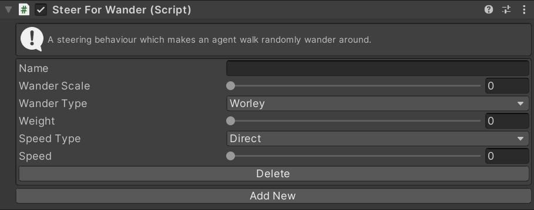

# SteerForWander

This MonoBehaviour causes an agent to steer randomly. It is not pure random noise as that would look very jittery and not at all natural.

## Inspector

#### Name

The unique ID of this steering action. Used to identify this instance in scripts.

#### Wander Scale

The size of the wander. A small scale will rapidly change direction very frequently. A large scale will slowly change direction more rarely.

#### Wander Type

Select if the noise used will be simplex or worley. Simplex noise is more random - the agent will smoothly change direction most of the time. Worley noise is more irregular - the agent will wander a short distance in a direction before more rapidly turning to a new direction.

#### Weight

The importance of this action relative to other steering actions.

#### Speed Type

The units for the `Speed` property. `Direct` means that the `Speed` setting is a speed in units/second. `Ideal` means that the `Speed` is a multiplier of the ideal speed (set in the `Navigator`). `Maximum` means that the `Speed` is a multiplier of the maximum speed (set in the `Navigator`).

#### Speed

The speed to wander at. The units of this value depend on the `Speed Type` property.

### Add New/Delete

Create a new instance of this steering behaviour or delete an existing instance.

## Scripting

#### `Create(string instanceName)`

Create a new steering action with the given name. If the name is `null` a random name will be chosen.

#### `TryGet(string instanceName)`

Try to get an existing steering action with the given name. Returns `null` if there is no action with that name.

#### `bool TryDelete(string instanceName)`

Try to delete the steering action with the given name. Returns `true` if an action with that name existed and was deleted.