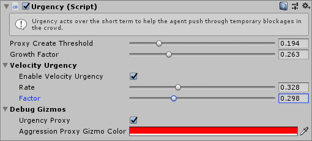

# Urgency

Urgency modifies how an agent acts within the Local Avoidance simulation to help it push through dense crowds more effectively. Urgency is a very short term modifier which helps the agent take the next few steps, it increases rapidly in response to failing to make progress through the crowd and resets back to zero very quickly as soon as the agent begins to push through successfully. For example it can prevent blockages in narrow doorways as the most urgent agent will push past less urgent agents coming the other way.

As `Urgency` increases the `Priority` of the agent increases (meaning it will yield less to other agents) and the `Personal Space` of the agent decreases (meaning it will squeeze through smaller gaps). See [`Local Avoidance`](/GettingStarted/LocalAvoidance) for more details on these parameters.

Once the `Urgency` exceeds the `Proxy Create Threshold` a "proxy agent" will be created just in front of the agent. The proxy agent is an obstacle which other agents must avoid but this agent ignores. This causes the crowd to part slightly in front of this agent, opening up a path for the agent.

## Inspector

#### Proxy Create Threshold

todo https://discordapp.com/channels/573292748430376974/573293314569404438/670336925198188595

#### Growth Factor

todo https://discordapp.com/channels/573292748430376974/573293314569404438/670336925198188595

### Velocity Urgency

#### Enable Velocity Urgency

todo

#### Rate

todo https://discordapp.com/channels/573292748430376974/573293314569404438/670339224586682409

#### Factor

todo https://discordapp.com/channels/573292748430376974/573293314569404438/670339224586682409

### Debug Gizmos

#### Aggression Proxy

todo

#### Aggression Proxy Gizmo Color

todo