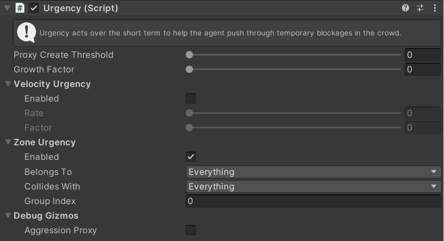

# Urgency

Urgency modifies how an agent acts within the Local Avoidance simulation to help it push through dense crowds more effectively. Urgency is a very short term modifier which helps the agent take the next few steps, it increases rapidly in response to failing to make progress through the crowd and resets back to zero very quickly as soon as the agent begins to push through successfully. For example it can prevent blockages in narrow doorways as the most urgent agent will push past less urgent agents coming the other way.

As `Urgency` increases the `Priority` of the agent increases (meaning it will be less willing to yield to other agents) and the `Personal Space` of the agent decreases (meaning it will squeeze through smaller gaps). See [`Local Avoidance`](/GettingStarted/LocalAvoidance) for more details on these parameters.

When Urgency is very high a proxy obstacle is created next to the agent in the direction it wants to travel. Other agents avoid the proxy obstacle which clears space for the agent to move into, this guarantees that an agent eventually makes progress.

## Inspector

#### Proxy Create Threshold

Once `Urgency` exceeds this level a "proxy obstacle" will be created just in front of this agent. Other agents will avoid the proxy but this agent will completely ignore it. This causes the crowd to part slightly in front of the agent, pushing open a path through a blockage.

#### Growth Factor

Once the `Urgency` is over the `Proxy Create Threshold` the proxy obstacle will grow to it's maximum size (the size of the agent) over a period of time. This parameter determines how quickly it grows. Increase it to push more aggressively through a crowd.

### Velocity Urgency

#### Enable Velocity Urgency

If this option is enabled Urgency will increase when the velocity the agent **wants** to move at (as determined by [`Steering Behaviours`](/GettingStarted/SteeringActions)) is different to the velocity the agent is actually moving at (as determined by [`Local Avoidance`](/GettingStarted/LocalAvoidance)).

#### Rate

The rate at which the current agent Urgency will move towards the velocity urgency. A larger `Rate` means the urgency is more responsive, but may act more erratically.

#### Factor

How much a difference in velocity affects Urgency. A small factor means that a very large difference in velocity is required for a change in Urgency.

### Zone Urgency

#### Enabled

Allow this agent to be affected by [Urgency Zones](../Zones/UrgencyZone).

The `Belongs To`, `Collides With` and `Group Index` properties configure the [collision filter](https://docs.unity3d.com/Packages/com.unity.physics@latest/manual/collision_queries.html#filtering) to use for this agent when detecting urgency zones.

### Debug Gizmos

#### Aggression Proxy

If enabled the proxy created by Urgency will be shown as a circle in front of the agent.

#### Aggression Proxy Gizmo Color

Sets the colour for the`Aggression Proxy` gizmo.