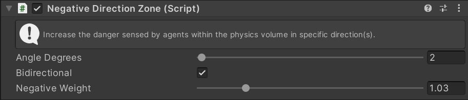
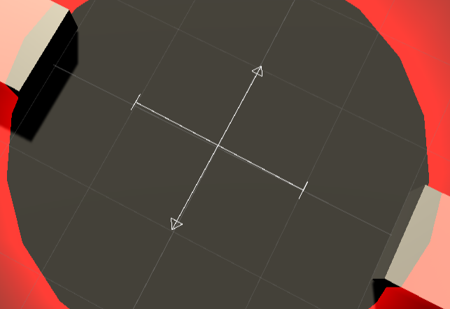
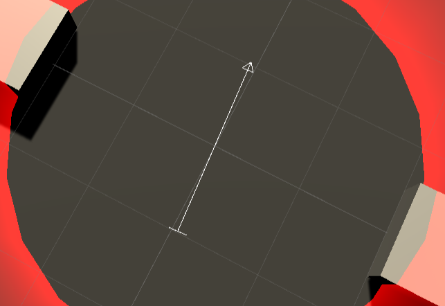

# Negative Zone

Increases the danger sensed in a certain direction for agents within the zone. Only affects agents with [Negative Zones](../../Navigator#negative-zones) enabled.

Can be used to encourage the crowd to flow in certain directions in crowded areas. For example a negative zone can be be set up across a corridor - this discourages agents moving _across_ the corridor rather than _along_ it.

## Inspector

#### Angle Degrees

Set the direction which this zone detects as a danger.

#### Bidirectional

If enabled this zone detects danger in two opposite directions. If disable this zone detects danger in all but one direction.

The gizmo indicates which directions danger is detected by a line terminated with a bar. Directions in which danger is not detected are indicated with an arrow:

#### Negative Weight

Set the negative weight that this zone creates in agents which are facing towards the discouraged directions.

## Setup

Physics zones require the `Unity.Physics` package to be installed. For a zone to work 3 other MonoBehaviours are required:

 - `Physics Shape`
 - `Physics Body`
 - `Convert To Entity`

