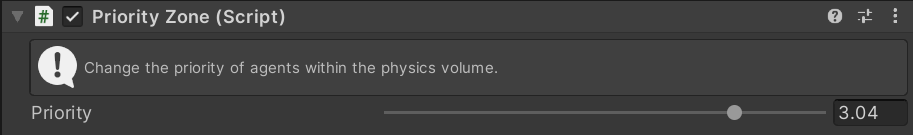

# Priority Zone

Increases the priority of agents within a physics volume. Lower priority agents yield to higher priority agents when a collision is imminent.

## Inspector

#### Priority

The amount of priority to add to agents in the zone. Only affects agents with [`Enable Priority Zones`](../../Navigator#enable-priority-zones) enabled.

## Setup

Physics zones require the `Unity.Physics` package to be installed. For a zone to work 3 other MonoBehaviours are required:
 - `Physics Shape`
 - `Physics Body`
 - `Convert To Entity`

