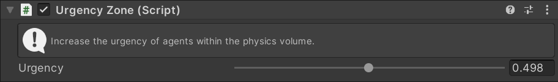

# Urgency Zone

Increases the [Urgency](../../Urgency) of agents within the physics volume. Urgency helps individual agents push through crowded areas.

## Inspector

#### Urgency

The amount of urgency to add to agents in the zone. Only affects agents with `Zone Urgency` enabled.

## Setup

Physics zones require the `Unity.Physics` package to be installed. For a zone to work 3 other MonoBehaviours are required:

 - `Physics Shape`
 - `Physics Body`
 - `Convert To Entity`

