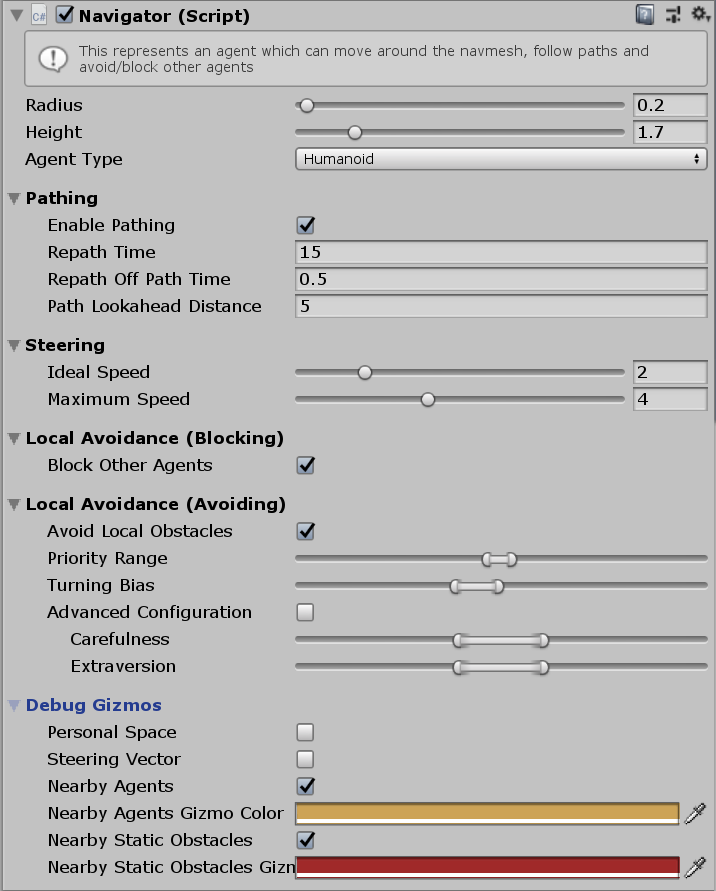

# Navigator

This MonoBehaviour is the main behaviour which configures a gameObject as an intelligent Agent.

## Inspector

#### Radius

todo

#### Height

todo

#### Agent Type

todo

#### Enable Pathing

todo

#### Repath Time

todo

#### Repath Off Path Time

todo

#### Path Lookahead Distance

todo

#### Ideal Speed

todo

#### Maximum Speed

todo

#### Block Other Agents

todo

#### Avoid Local Obstacles

todo

#### Priority Range

todo

#### Turning Bias

todo

#### Advanced Configuration

todo

#### Carefulness

todo

#### Evasion

todo

#### Personal Space Radius

todo

#### Time Horizon (Obstacles)

todo

#### Time Horizon (Agents)

todo

#### Max Neighbour Search Radius

todo

#### Max Neighbour Count

todo

#### Personal Space

todo

#### Steering Vector

todo

#### Nearby Agents

todo

#### Nearby Obstacles

todo