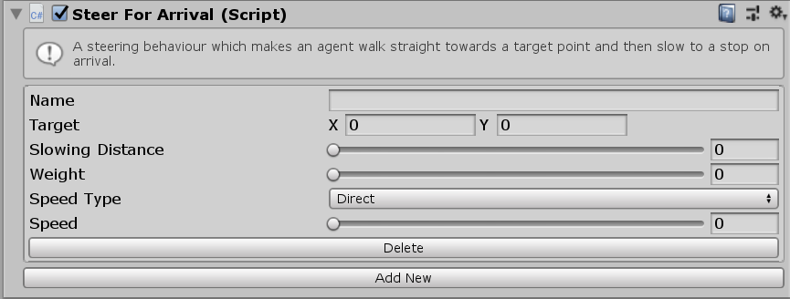

# SteerForArrival

This MonoBehaviour causes an agent to steer directly towards a target point and slow to a stop as it arrives.

## Inspector

#### Target

The target position (in 2D space) that the agent is walking towards. For example if you have a `transform` to walk towards you would set this to the `XZ` position of the `transform`.

#### Slowing Distance

The Agent will begin slowing to a stop when it is this far from the destination.

#### Weight

The Weight of this steering behaviour in the weighted average with all other steering behaviours.

#### Speed Type

The units for the `Speed` property. `Direct` means that the `Speed` setting is a speed in units/second. `Ideal` means that the `Speed` is a multiplier of the ideal speed (set in the `Navigator`). `Maximum` means that the `Speed` is a multiplier of the maximum speed (set in the `Navigator`).

#### Speed

The speed to move towards the target at. The units of this value depend on the `Speed Type` property.